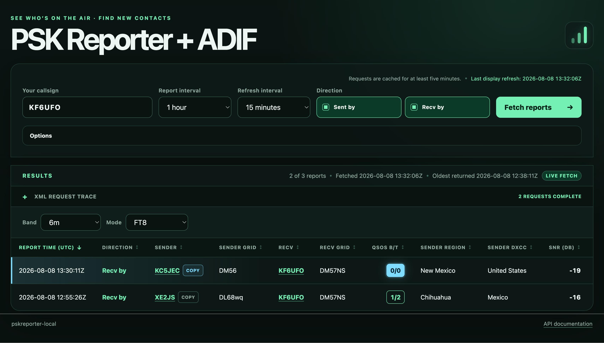

# pskreporter-local



`pskreporter-local` is a local-first web application that combines recent amateur-radio reception reports from the documented [PSK Reporter XML query interface](https://www.pskreporter.info/pskdev.html) with your local ADIF log.

Its central purpose is to answer an immediately useful operating question: **Which stations are on the air right now that I have not worked?** The live table places current PSK Reporter activity beside your QSO history, making unworked stations—and stations worked on another band but not the current one—visible at a glance.

The first release is intentionally table-focused. It provides this responsive live operating view without requiring a database or cloud account. Your ADIF log stays on the machine running the application and is read-only.

## Live activity meets your log

PSK Reporter can show that a station is transmitting or receiving now, while an ADIF log records whom you have worked in the past. Viewed separately, neither provides the complete operating picture. `pskreporter-local` brings them together in one table so you can quickly identify a potential new QSO while the station is active.

The **QSOs B/T** column compares each station with your log using `band/total` counts:

- `0/0` — you have never worked this station.
- `0/1` — you have worked the station once, but not on the current band.
- `1/1` — your one QSO with the station was on the current band.
- `2/5` — you have two QSOs on the current band and five across all bands.

This is particularly useful during short openings on bands such as 6 and 10 meters: a `0/0` or `0/n` station in the live reports is an immediate visual cue that there may be a new callsign or band contact available now.

## Features

- Query the last 15, 30, or 60 minutes, with 15 minutes as the default.
- Automatically refresh reports every 5, 10, or 15 minutes, with 10 minutes as the default, and show the last successful display refresh in UTC.
- Select PSK Reporter's `Sent by`, `Recv by`, or both directions.
- Show UTC report time, transmitter and receiver callsigns, both Maidenhead grids, sender region and DXCC, frequency in transceiver-style MHz, derived amateur band, and mode.
- Filter fetched results locally by band and mode.
- Distinguish empty results, upstream failures, and invalid XML.
- Cache equivalent upstream queries for at least five minutes.
- Inspect each upstream URL, response status, timing, size, parsed count, and raw XML.
- Configure the operator and service settings in a local JSON file.
- Offer the ten most recently queried callsigns as browser-local suggestions.
- Expose compatible PSK Reporter XML parameters in an expandable advanced-query panel.
- Load an operator-selected `.adi` or `.adif` log into memory and reload it manually.
- Compare every live report with that log and show current-band/all-band QSO counts for the other station.

## Requirements

- Python 3.11 or newer
- Network access to `https://retrieve.pskreporter.info`

## Quick start

Create a virtual environment and install the application with its test tools:

```bash
python3 -m venv .venv
.venv/bin/python -m pip install --upgrade pip
.venv/bin/python -m pip install -e '.[dev]'
```

Create your local configuration:

```bash
cp config.example.json config.json
```

Edit `config.json` and replace `N0CALL` with your callsign. You may set `app_contact` to an email address or leave it as `null`.

Run the tests, then start the application on macOS or Linux:

```bash
.venv/bin/pytest
./run.sh
```

On Windows Command Prompt, use:

```bat
.venv\Scripts\python -m pytest
run.cmd
```

Both launchers run Uvicorn at `http://127.0.0.1:8765` with automatic reload enabled.

Open [http://127.0.0.1:8765/](http://127.0.0.1:8765/). Interactive API documentation is available at [http://127.0.0.1:8765/api/docs](http://127.0.0.1:8765/api/docs).

## Configuration

The application reads `config.json` from its working directory when it starts. The operator-specific file is ignored by Git; [config.example.json](config.example.json) is the safe template committed to the repository.

```json
{
  "default_callsign": "N0CALL",
  "app_contact": null,
  "adif_file_path": null,
  "cache_ttl_seconds": 300,
  "report_limit": 1000,
  "http_timeout_seconds": 10,
  "max_xml_bytes": 5000000,
  "query_url": "https://retrieve.pskreporter.info/query"
}
```

| JSON setting | Default | Purpose |
| --- | --- | --- |
| `default_callsign` | `null` | Callsign initially shown in the query form. It can still be changed in the browser. |
| `app_contact` | `null` | Optional contact sent to PSK Reporter as `appcontact`; it is redacted in the displayed trace URL. |
| `adif_file_path` | `null` | Absolute path to an ADI log, or a path relative to `config.json`. |
| `cache_ttl_seconds` | `300` | Query-cache lifetime. Values below 300 are raised to 300. |
| `report_limit` | `1000` | Maximum reports requested per upstream query. |
| `http_timeout_seconds` | `10` | Upstream request timeout in seconds. |
| `max_xml_bytes` | `5000000` | Maximum accepted XML response size. |
| `query_url` | Official endpoint | Alternate compatible endpoint, primarily for testing. |

The file is optional; built-in defaults are used if it is absent. If it is present, its JSON must be valid. Unknown setting names, incorrect value types, and invalid default callsigns cause startup to fail with a configuration error so mistakes are visible immediately.

Host and port are server settings and therefore remain Uvicorn command-line arguments. Restart the application after changing `config.json`.

## ADIF log

Set `adif_file_path` to make a local ADI log available to the application:

```json
{
  "default_callsign": "N0CALL",
  "adif_file_path": "logs/operator.adi"
}
```

Relative paths are resolved from the directory containing `config.json`. Absolute paths are useful when the logging software writes elsewhere or the log is mounted from another machine.

The application reads the file at startup and stores its parsed QSO records plus a callsign-count index in memory—no database is used. The expandable **ADIF log** section displays the resolved path, load state, QSO count, file modification time, and a **Reload ADIF** button. Reload reads the file again after logging software changes it; automatic file watching is intentionally deferred.

When an ADI log is loaded, the report table's **QSOs B/T** column shows `band/total` logged contacts with the other station. For a `Sent by` report this is the receiver; for a `Recv by` report it is the sender. For example, `0/1` means no QSO on the report's current band and one QSO on another band; `2/5` means two on the current band and five across all bands; and `0/0` means the callsign has not been worked. An em dash means no usable ADI log has been loaded. Counts are case-insensitive but otherwise require an exact ADIF `CALL` match, and the band count uses the record's ADIF `BAND` field.

The path is on the machine running the Python service. If the browser and service are on different machines, copy, synchronize, or mount the ADI file where the service can read it. A missing file, permissions problem, or parse error is reported in the ADIF section without stopping PSK Reporter queries.

## How queries work

The browser talks only to the local FastAPI service. `Sent by` uses PSK Reporter's `senderCallsign` parameter; `Recv by` uses `receiverCallsign`. Selecting both performs and caches the two documented XML queries separately, then merges duplicate reports for display.

The XML trace shows the interval and report limit requested as well as the oldest report actually returned. If the configured limit is reached, the interface warns that results may be incomplete.

### Advanced query options

The collapsed **Advanced query options** panel exposes the compatible parameters from PSK Reporter's documented XML query interface:

| Parameter | Initial value | Effect |
| --- | --- | --- |
| `mode` | Any | Ask PSK Reporter for one mode. This is separate from the local results filter. |
| `frange` | Empty | Limit frequency in Hz using `lower-upper`, such as `14000000-14100000`. |
| `rptlimit` | `report_limit` from `config.json` | Limit returned reception reports for this query. |
| `lastseqno` | Empty | Return records at or above a sequence number. |
| `modify` | None | Set `grid` to interpret the entered callsign value as a grid square. |
| `rronly` | Enabled | Return reception-report records only. |
| `noactive` | Enabled | Exclude active-monitor records. |
| `nolocator` | Enabled | Include reports that do not contain a locator. |
| `statistics` | Disabled | Ask the upstream response to include statistical information. |

The primary callsign, direction, and report-interval controls produce `senderCallsign` or `receiverCallsign` and `flowStartSeconds`. The browser-only refresh interval controls when that query is repeated and does not change the upstream parameters. `appcontact` remains an application setting in `config.json`. `callback` is intentionally unavailable because it changes the response from XML to JavaScript, which is incompatible with the parser.

Every advanced option participates in the five-minute cache key. Equivalent options reuse a cached response; changing an upstream option produces a distinct PSK Reporter request.

## Deployment

See [DEPLOYMENT.md](DEPLOYMENT.md) for a generic installation on another machine, direct local-network serving, service-manager guidance, updates, and security considerations.

Run exactly one application worker in this release. The five-minute cache is stored in process memory, so multiple workers could make duplicate upstream requests.

## Current scope

Exact-call worked-before counts are displayed by current band and across all bands, but controlled portable/base-call matching is not yet implemented. UDP, MQTT, QRZ lookup, mapping, databases, cloud hosting, and multi-user access remain outside the current scope. Multi-hour history is also excluded because PSK Reporter's real-time XML query does not reliably return the complete requested interval.

Planned increments are:

1. Complete and stabilize the responsive report table and XML pipeline.
2. Extend the in-memory ADIF counts with controlled portable-call matching and richer worked-before details.
3. Consider mapping after the table and ADIF workflow are reliable.

## License

MIT
